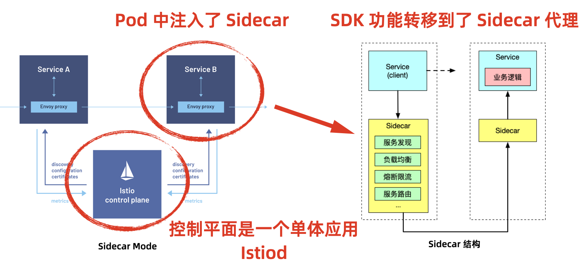

# Istio 架构解析

Istio 是目前最流行的服务网格的开源实现，它的架构目前来说有两种，一种是 Sidecar 模式，这也是 Istio 最传统的部署架构，另一种是 Proxyless 模式。

## Sidecar 模式

Sidecar 模式是 Istio 开源之初就在使用的模式，这种模式将应用程序的功能划分为单独的进程运行在同一个最小调度单元中，比如 Kubernetes 的 Pod 中。这种架构分为两个部分：控制平面和数据平面，控制平面是一个单体应用 Istiod，数据平面是由注入在每个 Pod 中的 Envoy 代理组成。你可以在 Sidecar 中添加更多功能，而不需要修改应用程序代码。这也是服务网格最大的一个卖点之一，将原先的应用程序 SDK 中的功能转移到了 Sidecar 中，这样开发者就可以专注于业务逻辑，而 sidecar 就交由运维来处理。

我们在看下应用程序 Pod 中的结构。Pod 中包含应用容器和 Sidecar 容器，sidecar 容器与控制平面通信，获取该 Pod 上的所有代理配置，其中还有个 Init 容器，它是在注入 Sidecar 之前启动的，用来修改 Pod 的 IPtables 规则，做流量拦截的。

## Proxyless 模式

Proxyless 模式是 Istio 1.11 版本中支持的实验特性，Istio 官网中有篇博客介绍了这个特性。可以直接将 gRPC 服务添加到 Istio 中，不需要再向 Pod 中注入 Envoy 代理。这样做可以极大的提升应用性能，降低网络延迟。有人说这种做法又回答了原始的基于 SDK 的微服务模式，其实非也，它依然使用了 Envoy 的 xDS API，但是因为不再需要向应用程序中注入 Sidecar 代理，因此可以减少应用程序性能的损耗。

## 总结

Istio 虽然从诞生之初就是用的是 Sidecar 模式，但是随着网格规模的增大，大量的 Sidecar 对系统造成的瓶颈，及如 eBPF 这里网络技术的演进，未来我们有可能看到部分服务网格的功能，如透明流量劫持、证书配置等下沉到内核层，Istio 的架构也不一定会一成不变。
