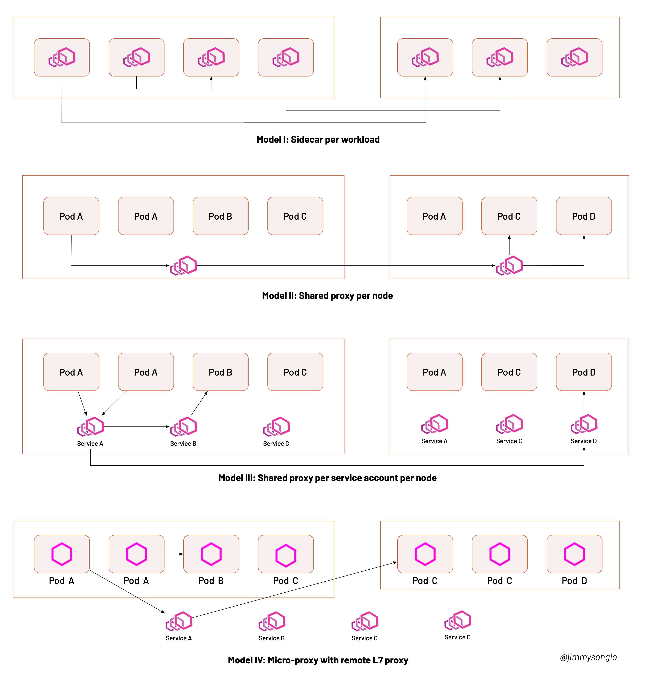

# 服务网格架构

这一节中，我将为你介绍服务网格的架构，首先我们先来了解下服务网格常用的四种部署模式，然后是其最基本的组成部分——控制平面和数据平面。

## 服务网格的部署模式

这四种模式分别是Sidecar 代理、节点共享代理、Service Account/节点共享代理、带有微代理的共享远程代理。

这几种架构模式的主要区别是代理所在的位置不同，模式一在每个应用程序旁运行一个代理，模式二在每个节点上运行一个代理，模式三在每个节点中，再根据 ServiceAccount 的数量，每个 ServiceAccount 运行一个代理，模式四在每个应用旁运行一个微代理，这个代理仅处理 mTLS ，而七层代理位于远程，这几种方式在安全性、隔离及运维开销上的对比如这个表格所示。

| **模式**                         | **内存开销**                                                 | **安全性**                                                   | **故障域**                                                   | **运维**                                                  |
| -------------------------------- | ------------------------------------------------------------ | ------------------------------------------------------------ | ------------------------------------------------------------ | --------------------------------------------------------- |
| **Sidecar 代理**                 | 因为为每个 pod 都注入一个代理，所以开销最大。                | 由于 sidecar 必须与工作负载一起部署，工作负载有可能绕过 sidecar。 | Pod 级别隔离，如果有代理出现故障，只影响到 Pod 中的工作负载。 | 可以单独升级某个工作负载的 sidecar 而不影响其他工作负载。 |
| **节点共享代理**                 | 每个节点上只有一个代理，为该节点上的所有工作负载所共享，开销小。 | 对加密内容和私钥的管理存在安全隐患。                         | 节点级别隔离，如果共享代理升级时出现版本冲突、配置冲突或扩展不兼容等问题，则可能会影响该节点上的所有工作负载。 | 不需要考虑注入 Sidecar 的问题。                           |
| **Service Account/节点共享代理** | 服务账户/身份下的所有工作负载都使用共享代理，开销小。        | 工作负载和代理之间的连接的认证及安全性无法保障。             | 节点和服务账号之间级别隔离，故障同“节点共享代理”。           | 同“节点共享代理”。                                        |
| **带有微代理的共享远程代理**     | 因为为每个 pod 都注入一个微代理，开销比较大。                | 微代理专门处理 mTLS，不负责 L7 路由，可以保障安全性。        | 当需要应用7层策略时，工作负载实例的流量会被重定向到L7代理上，若不需要，则可以直接绕过。该L7代理可以采用共享节点代理、每个服务账户代理，或者远程代理的方式运行。 | 同“Sidecar 代理”。                                        |

Istio 是目前最流行的服务网格的开源实现，它的架构目前来说有两种，一种是 Sidecar 模式，这也是 Istio 最传统的部署架构，另一种是 Proxyless 模式。这两种模式，我们将在下一节中介绍。

下面我们将介绍服务网格的两个主要组成部分——控制平面和数据平面。

## 控制平面

控制平面的特点：

- 不直接解析数据包
- 与控制平面中的代理通信，下发策略和配置
- 负责网络行为的可视化
- 通常提供 API 或者命令行工具可用于配置版本化管理，便于持续集成和部署

## 数据平面

数据平面的特点：

- 通常是按照无状态目标设计的，但实际上为了提高流量转发性能，需要缓存一些数据，因此无状态也是有争议的
- 直接处理入站和出站数据包，转发、路由、健康检查、负载均衡、认证、鉴权、产生监控数据等
- 对应用来说透明，即可以做到无感知部署
