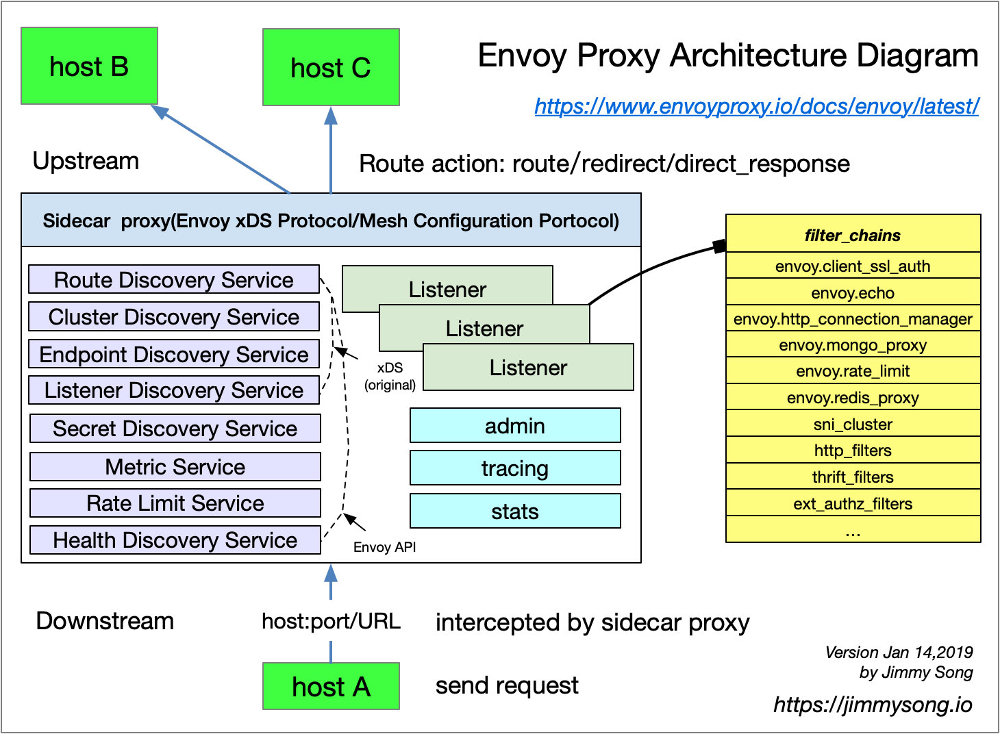

# Envoy API

Envoy 提供了如下的 API：

- CDS（Cluster Discovery Service）：集群发现服务
- EDS（Endpoint Discovery Service）：端点发现服务
- HDS（Health Discovery Service）：健康发现服务
- LDS（Listener Discovery Service）：监听器发现服务
- MS（Metric Service）：将 metric 推送到远端服务器
- RLS（Rate Limit Service）：速率限制服务
- RDS（Route Discovery Service）：路由发现服务
- SDS（Secret Discovery Service）：秘钥发现服务

所有名称以 DS 结尾的服务统称为 xDS。

本书中仅讨论 v2 版本的 API，因为 Envoy 仍在不断开发和完善中，随着版本迭代也有可能新增一些 API，本章的重点在于 xDS 协议，关于 Envoy 的 API 的更多信息请参考 [Envoy v2 APIs for developers](https://github.com/envoyproxy/envoy/blob/master/api/API_OVERVIEW.md)。

## Envoy xDS 协议

Envoy xDS 为 Istio 控制平面与数据平面通信的基本协议，只要代理支持该协议表达形式就可以创建自己 Sidecar 来替换 Envoy。这一章中将带大家了解 Envoy xDS。

Envoy 是 Istio Service Mesh 中默认的 Sidecar，Istio 在 Envoy 的基础上按照 Envoy 的 xDS 协议扩展了其控制平面，在讲到 Envoy xDS 协议之前还需要我们先熟悉下 Envoy 的基本术语。下面列举了 Envoy 里的基本术语及其数据结构解析，关于 Envoy 的详细介绍请参考 [Envoy 官方文档](http://www.servicemesher.com/envoy/)，至于 Envoy 在 Service Mesh（不仅限于 Istio） 中是如何作为转发代理工作的请参考网易云刘超的这篇[深入解读 Service Mesh 背后的技术细节 ](https://www.cnblogs.com/163yun/p/8962278.html)以及[理解 Istio Service Mesh 中 Envoy 代理 Sidecar 注入及流量劫持](https://jimmysong.io/posts/envoy-sidecar-injection-in-istio-service-mesh-deep-dive/)，本文引用其中的一些观点，详细内容不再赘述。



## 关于 xDS 的版本

有一点需要大家注意，就是 Envoy 的 API 有 v1 和 v2 两个版本，从 Envoy 1.5.0 起 v2 API 就已经生产就绪了，为了能够让用户顺利的向 v2 版本的额 API 过度，Envoy 启动的时候设置了一个 `--v2-config-only` 的标志，Envoy 不同版本对 v1/v2 API 的支持详情请参考 [Envoy v1 配置废弃时间表](https://groups.google.com/forum/#!topic/envoy-announce/Lb1QZcSclGQ)。

Envoy 的作者 Matt Klein 在 [Service Mesh 中的通用数据平面 API 设计](http://www.servicemesher.com/blog/the-universal-data-plane-api/)这篇文章中说明了 Envoy API v1 的历史及其缺点，还有 v2 的引入。v2 API 是 v1 的演进，而不是革命，它是 v1 功能的超集。

在 Istio 1.0 及以上版本中使用的是 **Envoy 1.8.0-dev** 版本，其支持 v2 的 API，同时在 Envoy 作为 Sidecar proxy 启动的使用使用了例如下面的命令：

```bash
$ /usr/local/bin/envoy -c /etc/istio/proxy/envoy-rev0.json --restart-epoch 0 --drain-time-s 45 --parent-shutdown-time-s 60 --service-cluster ratings --service-node sidecar~172.33.14.2~ratings-v1-8558d4458d-ld8x9.default~default.svc.cluster.local --max-obj-name-len 189 --allow-unknown-fields -l warn --v2-config-only
```

上面是都 Bookinfo 示例中的 rating pod 中的 sidecar 启动的分析，可以看到其中指定了 `--v2-config-only`，表明 Istio 1.0+ 只支持 xDS v2 的 API。

## REST-JSON & gPRC API

单个的基本 xDS 订阅服务，如 CDS、EDS、LDS、RDS、SDS 同时支持 REST-JSON 和 gRPC API 配置。高级 API，如 HDS、ADS 和 EDS 多维 LB 仅支持 gRPC。这是为了避免将复杂的双向流语义映射到 REST。详见 [Envoy v2 APIs for developers](https://github.com/envoyproxy/envoy/blob/master/api/API_OVERVIEW.md)。

## 参考

- [Service Mesh 中的通用数据平面 API 设计 - servicemesher.com](http://www.servicemesher.com/blog/the-universal-data-plane-api/)
- [Envoy v2 APIs for developers - github.com](https://github.com/envoyproxy/envoy/blob/master/api/API_OVERVIEW.md)
